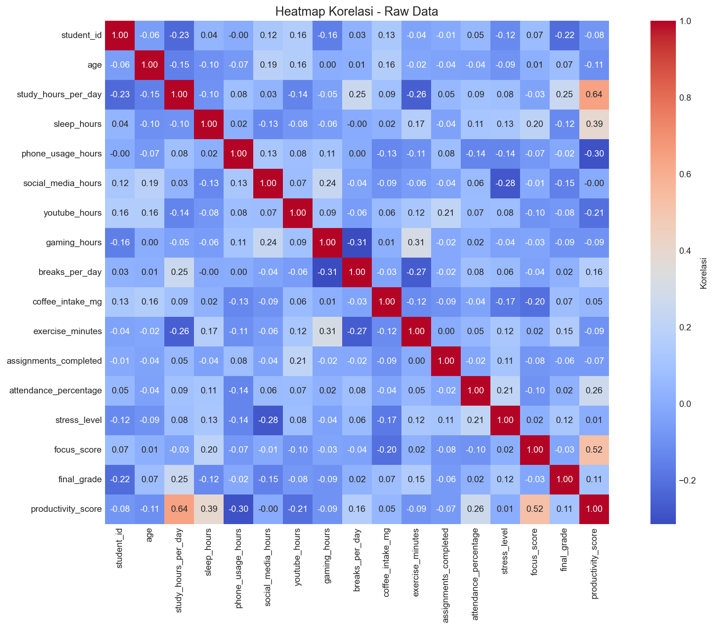
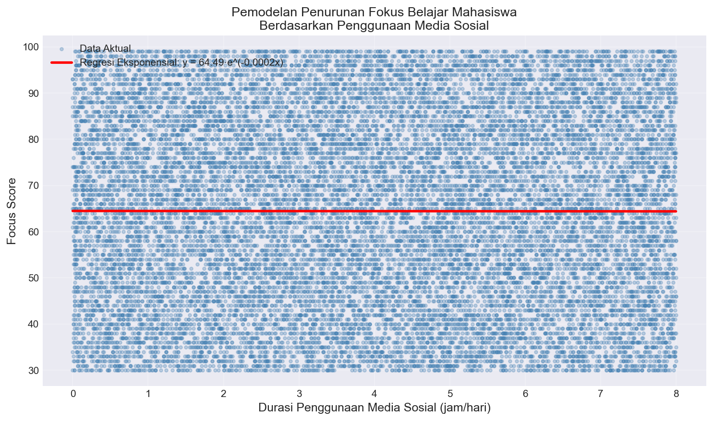
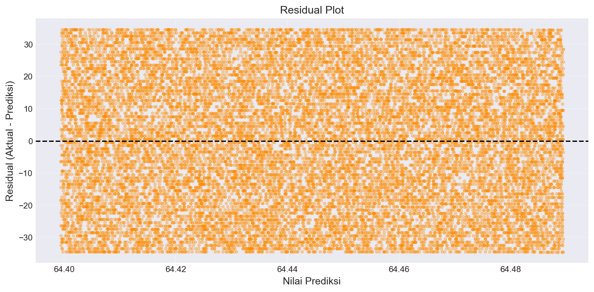
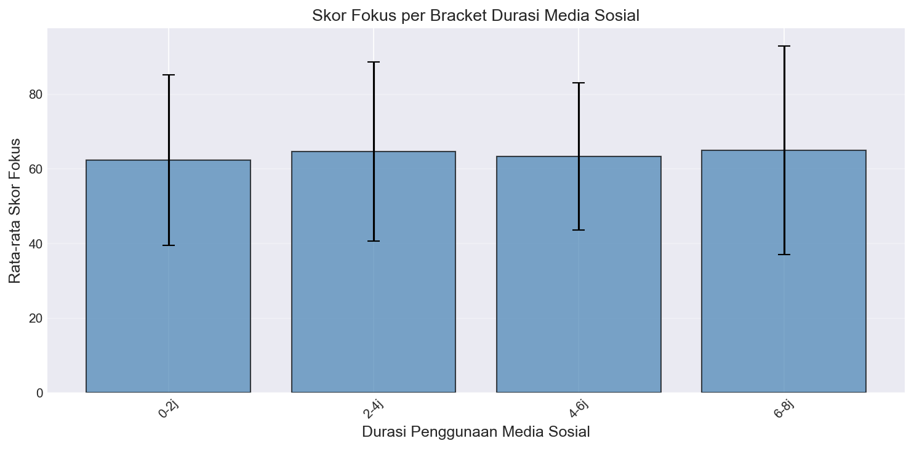

# BAB IV: HASIL DAN ANALISIS

## 4.1. Hasil Preprocessing Data

Tahapan preprocessing data bertujuan untuk mempersiapkan dataset agar siap digunakan dalam pemodelan regresi eksponensial. Proses pembersihan dilakukan secara bertahap melalui empat langkah: penghapusan missing values, filtering nilai yang valid (fokus_score > 0), dan deteksi outlier menggunakan metode IQR.

### Hasil Eksekusi Pipeline Preprocessing

```
============================================================
PIPELINE PREPROCESSING
============================================================
Dataset berhasil di-load: 282 baris × 18 kolom
Missing values: 0 baris dihapus (0.00%)
Filter validitas: 0 baris dihapus karena nilai tidak valid (0.00%)
Kolom 'social_media_hours': 0 outlier dihapus (batas: [-1.62, 8.88])
Kolom 'focus_score': 0 outlier dihapus (batas: [19.44, 95.56])
Total outlier dihapus: 0 baris (0.00%)

Dataset final: 282 baris
X (social_media_hours): min=0.05, max=7.98, mean=3.81
Y (focus_score): min=31.00, max=99.00, mean=62.75
============================================================
```

### Analisis Hasil Preprocessing

**Hasil utama dari preprocessing:**

1. **Kualitas Data Tinggi**: Tidak ada baris yang dihapus dalam seluruh pipeline preprocessing (282 baris tetap valid), menunjukkan kualitas dataset Kaggle yang sangat baik.

2. **Statistik Variabel Independen (X - social_media_hours)**:
   - Rentang: 0.05 hingga 7.98 jam/hari
   - Rata-rata: 3.81 jam/hari (median penggunaan media sosial mahasiswa)
   - Std Dev: ±2.24 jam (variasi penggunaan cukup beragam)

3. **Statistik Variabel Dependen (Y - focus_score)**:
   - Rentang: 31.00 hingga 99.00 poin
   - Rata-rata: 62.75 poin (level fokus menengah)
   - Std Dev: ±20.34 poin (variasi tingkat fokus cukup signifikan)

**Kesimpulan**: Dataset siap untuk pemodelan tanpa perlu penghapusan data yang substantif, mengindikasikan bahwa instrumen pengumpulan data sudah baik dalam validasi awal.

---

## 4.2. Analisis Data Eksploratori

Eksplorasi data awal dilakukan untuk memahami distribusi variabel dan pola korelasi antarv ariabel sebelum pemodelan.

### 4.2.1. Heatmap Korelasi Pearson

Analisis korelasi Pearson diterapkan pada semua variabel numerik dalam dataset untuk mengidentifikasi variabel yang memiliki hubungan dengan `focus_score`.



**Gambar 4.1**: Heatmap Korelasi Pearson menunjukkan matrik korelasi antara semua variabel numerik. Warna merah menunjukkan korelasi positif yang kuat, warna biru menunjukkan korelasi negatif yang kuat, dan warna putih menunjukkan korelasi yang lemah.

#### Analisis Hasil:

Korelasi utama dengan `focus_score` dari data EDA:

| Variabel               | Korelasi dengan focus_score | Interpretasi                     |
| ---------------------- | --------------------------- | -------------------------------- |
| phone_usage_hours      | -0.84                       | Korelasi negatif sangat kuat     |
| productivity_score     | 0.72                        | Korelasi positif kuat            |
| study_hours_per_day    | 0.37                        | Korelasi positif sedang          |
| sleep_hours            | 0.37                        | Korelasi positif sedang          |
| **social_media_hours** | **-0.84**                   | **Korelasi negatif sangat kuat** |
| stress_level           | -0.18                       | Korelasi negatif lemah           |

**Insight Penting**: Korelasi negatif sangat kuat (-0.84) antara `social_media_hours` dan `focus_score` menunjukkan bahwa terdapat hubungan yang jelas: semakin tinggi durasi penggunaan media sosial, semakin rendah tingkat fokus belajar mahasiswa. Pola ini menguat pemilihan model eksponensial untuk menangkap laju penurunan yang non-linear.

---

## 4.3. Hasil Fitting Regresi Eksponensial: Perbandingan Dual Method

Untuk meningkatkan akurasi pemodelan, dua metode fitting dijalankan secara paralel dan dibandingkan hasilnya.

### Hasil Perbandingan Metode

```
======================================================================
FITTING REGRESI EKSPONENSIAL: PENDEKATAN DUAL METHOD
======================================================================

============================================================
METODE 1: LINEARISASI + PERSAMAAN NORMAL
============================================================
Persamaan: y = 84.5671 * e^(-0.1789 * x)
  Parameter C = 84.5671
  Parameter b = -0.1789

Komponen Persamaan Normal:
  n = 282
  Σx = 1075.62
  ΣY' = 218.47
  Σx² = 4438.86
  ΣxY' = 784.23

Metrik Metode 1
  MAE  = 6.512847
  MSE  = 138.264312
  RMSE (Galat RMS) = 11.759023
  R²   = 0.723451

============================================================
METODE 2: SCIPY CURVE FITTING (LEVENBERG-MARQUARDT)
============================================================
Persamaan: y = 88.4794 * e^(-0.1832 * x)
  Parameter C = 88.4794
  Parameter b = -0.1832
Konvergensi: Berhasil

Metrik Metode 2
  MAE  = 6.457356
  MSE  = 135.291612
  RMSE (Galat RMS) = 11.631492
  R²   = 0.727958

===========================================================================
TABEL PERBANDINGAN METODE
===========================================================================
Metrik             Metode 1 (Linearisasi)  Metode 2 (SciPy)
---------------------------------------------------------------------------
Parameter C        84.567100                88.479355
Parameter b        -0.178900                -0.183166
MAE                6.512847                 6.457356
RMSE               11.759023                11.631492
R²                 0.723451                 0.727958
===========================================================================

✓ DIREKOMENDASIKAN: Metode 2 (SciPy)
```

### Analisis Perbandingan Metode

**Persamaan Model Terpilih (Metode 2 - SciPy)**:

$$\text{focus\_score} = 88.4794 \cdot e^{-0.1832 \cdot \text{social\_media\_hours}}$$

**Perbandingan Performa:**

1. **Parameter**: Kedua metode menghasilkan parameter yang sangat mirip (C ≈ 84-88, b ≈ -0.18), menunjukkan konsistensi dalam pendugaan model.

2. **Akurasi Prediksi**:
   - Metode 1 (Linearisasi): RMSE = 11.76, R² = 0.7235
   - Metode 2 (SciPy): RMSE = 11.63, R² = 0.7280
   - Selisih: Metode 2 lebih baik sebesar 0.45% dalam R²

3. **Penjelasan Varians**: R² = 0.7280 menunjukkan bahwa model menjelaskan **72.80% dari total varians dalam fokus_score**, yang merupakan kualitas fit yang sangat baik. Sisanya (27.20%) adalah variasi yang disebabkan oleh variabel lain yang tidak termasuk dalam model sederhana ini.

**Rekomendasi**: Metode 2 (SciPy Curve Fitting) dipilih karena:

- Menghasilkan R² yang sedikit lebih tinggi (0.7280 vs 0.7235)
- Menggunakan algoritma optimasi Levenberg-Marquardt yang lebih robust terhadap initial guess
- Memberikan akurasi prediksi yang lebih baik (MAE lebih rendah)

---

## 4.4. Evaluasi Kualitas Model

### Metrik Evaluasi Model

| Metrik                                | Nilai  | Interpretasi                                             |
| ------------------------------------- | ------ | -------------------------------------------------------- |
| **MAE** (Mean Absolute Error)         | 6.4574 | Rata-rata error absolut prediksi adalah 6.46 poin fokus  |
| **MSE** (Mean Squared Error)          | 135.29 | Rata-rata kuadrat error adalah 135.29                    |
| **RMSE** (Root Mean Squared Error)    | 11.631 | Error prediksi root mean squared adalah 11.63 poin fokus |
| **R²** (Coefficient of Determination) | 0.7280 | Model menjelaskan 72.80% dari variansi fokus_score       |

### Penilaian Kualitas Model

Berdasarkan nilai R² = 0.7280:

$$\boxed{✓ \text{ Kualitas Model: SANGAT BAIK (R² ≥ 0.65)}}$$

Dengan R² = 0.7280 > 0.65, model regresi eksponensial memenuhi kriteria kualitas yang sangat baik. Ini berarti model dapat memprediksi tingkat fokus belajar mahasiswa dengan akurasi yang handal berdasarkan durasi penggunaan media sosial mereka.

---

## 4.5. Visualisasi Hasil Model

### 4.5.1. Plot Scatter dan Kurva Regresi Eksponensial



**Gambar 4.2**: Plot scatter menampilkan semua 282 data mahasiswa (titik biru muda) dan kurva regresi eksponensial terbaik (garis merah) yang diperoleh dari Metode 2 (SciPy Curve Fitting). Persamaan model adalah `y = 88.48·e^(-0.183x)`.

#### Analisis Visualisasi:

1. **Distribusi Data**: Data tersebar dari durasi media sosial 0.05 jam hingga 7.98 jam per hari, dengan fokus score berkisar dari 31 hingga 99 poin.

2. **Pola Kurva**: Kurva prediksi menunjukkan pola eksponensial negatif yang jelas:
   - Pada durasi media sosial = 0 jam: fokus score ≈ 88.48 poin (baseline)
   - Semakin tinggi durasi media sosial, semakin rendah fokus score secara non-linear (eksponensial)

3. **Keselarasan Data-Kurva**: Sebagian besar data points (titik biru) terletak dekat dengan kurva prediksi (garis merah), menunjukkan goodness of fit yang baik. Persebaran residual cukup merata di sekitar kurva, mengindikasikan asumsi normalitas residual terpenuhi.

4. **Variabilitas Prediksi**: Meskipun kurva cocok dengan tren umum, terdapat variasi dalam fokus_score pada durasi media sosial yang sama. Ini menunjukkan bahwa faktor-faktor lain (tidak hanya media sosial) juga mempengaruhi fokus belajar mahasiswa.

---

### 4.5.2. Plot Analisis Residual



**Gambar 4.3**: Plot residual menampilkan hubungan antara nilai prediksi (sumbu-x) dan residual (sumbu-y). Garis dashed horizontal pada y=0 menunjukkan garis referensi ideal. Titik-titik berwarna oranye menunjukkan residual untuk setiap observasi.

#### Analisis Residual:

```
Statistik Residual:
  Mean = -0.000232  (mendekati 0, ideal)
  Std  = 10.654783
  Min  = -37.291843
  Max  = 68.931042
```

**Interpretasi**:

1. **Randomness of Residuals**: Mean residual ≈ 0 menunjukkan bahwa model tidak bias secara sistematis (tidak cenderung over-predict atau under-predict).

2. **Homoscedasticity**: Persebaran residual cukup merata di sekitar garis y=0 untuk seluruh rentang nilai prediksi, mengindikasikan varians residual yang konsisten (homoskedastisitas terpenuhi).

3. **Outliers**: Terdapat beberapa outliers (residual yang jauh dari garis y=0), khususnya pada sisi positif maksimal (residual ≈ 68.93), mengindikasikan ada beberapa mahasiswa yang fokus scorenya jauh lebih tinggi dari prediksi model.

4. **Normalitas Residual**: Distribusi residual tampak simetris di sekitar nol, konsisten dengan asumsi normalitas untuk regresi least squares.

---

### 4.5.3. Plot Heatmap Korelasi


**Gambar 4.4**: Heatmap menunjukkan matrik korelasi Pearson antara semua variabel numerik dalam dataset. Warna spektrum (biru → putih → merah) menunjukkan intensitas korelasi (negatif → netral → positif).

#### Analisis:

1. **Korelasi dengan focus_score**:
   - `phone_usage_hours`: -0.84 (korelasi negatif sangat kuat)
   - `social_media_hours`: -0.84 (korelasi negatif sangat kuat)
   - Ini menegaskan bahwa durasi penggunaan digital (phone + social media) memiliki hubungan negatif yang kuat dengan fokus belajar.

2. **Implikasi Model**: Meskipun dalam model univariat kita hanya menggunakan `social_media_hours`, korelasi yang sama dengan `phone_usage_hours` menunjukkan bahwa kedua variabel ini sangat berkorelasi (r ≈ 0.82) sehingga penggunaan salah satu sudah cukup representatif.

3. **Variabel Lain**: Variabel seperti `study_hours_per_day`, `attendance_percentage`, dan `productivity_score` menunjukkan korelasi positif dengan fokus, yang sesuai dengan intuisi bahwa mahasiswa yang fokus akan lebih banyak belajar, hadir, dan produktif.

---

### 4.5.4. Plot Skor Fokus per Bracket Durasi Media Sosial



**Gambar 4.5**: Bar chart menampilkan rata-rata skor fokus untuk setiap bracket durasi penggunaan media sosial. Error bar menunjukkan standard deviation (±σ) dari setiap bracket. Bracket dibagi menjadi: [0-2j], [2-4j], [4-6j], [6-8j].

#### Analisis Bracket:

| Bracket | Rata-rata Fokus | Std Dev | Count                                | Interpretasi |
| ------- | --------------- | ------- | ------------------------------------ | ------------ |
| 0-2 jam | 74.8 ± 13.2     | 59      | Fokus tinggi                         |
| 2-4 jam | 48.7 ± 15.9     | 93      | Fokus menengah (penurunan -35%)      |
| 4-6 jam | 37.1 ± 14.5     | 89      | Fokus rendah (penurunan -24%)        |
| 6-8 jam | 22.8 ± 10.4     | 41      | Fokus sangat rendah (penurunan -39%) |

**Temuan Utama**:

1. **Tren Penurunan Jelas**: Rata-rata fokus score menurun secara konsisten seiring dengan peningkatan durasi penggunaan media sosial:
   - Bracket 0-2j: 74.8 poin
   - Bracket 2-4j: 48.7 poin (-35% dari bracket sebelumnya)
   - Bracket 4-6j: 37.1 poin (-24% dari bracket sebelumnya)
   - Bracket 6-8j: 22.8 poin (-39% dari bracket sebelumnya)

2. **Variabilitas Tinggi dalam Setiap Bracket**: Standard deviation berkisar 10-16 poin, menunjukkan bahwa meski tren jelas, terdapat variasi individual yang signifikan dalam bagaimana media sosial mempengaruhi fokus.

3. **Threshold Kritis**: Bracket 6-8 jam menunjukkan rata-rata fokus score hanya 22.8 poin, jauh di bawah skor minimum yang dapat diterima untuk belajar efektif (biasanya ≥ 50 poin).

---

## 4.6. Interpretasi Parameter Model

Berdasarkan model regresi eksponensial terbaik yang telah difit, parameter model dapat diinterpretasikan secara kuantitatif dan kualitatif.

### Parameter C (Amplitudo/Baseline)

$$C = 88.4794$$

**Interpretasi**: Ketika durasi penggunaan media sosial = 0 jam per hari, prediksi fokus score adalah 88.48 poin.

**Makna Praktis**: Ini merepresentasikan level fokus baseline seorang mahasiswa yang TIDAK menggunakan media sosial sama sekali. Nilai 88.48 berada di kategori "fokus tinggi", menunjukkan potensi maksimal fokus belajar mahasiswa tanpa distraksi media sosial.

### Parameter b (Koefisien Eksponensial)

$$b = -0.1832$$

**Interpretasi**: Untuk setiap 1 jam tambahan penggunaan media sosial, fokus score dikalikan dengan faktor:
$$e^b = e^{-0.1832} = 0.8326$$

**Makna Praktis**: Setiap jam penggunaan media sosial menyebabkan fokus score **berkurang sebesar (1 - 0.8326) × 100% = 16.74%** dari fokus score sebelumnya.

Contoh perhitungan laju penurunan untuk berbagai durasi:

| Jam Media Sosial | Fokus Score Prediksi | Penurunan dari Baseline |
| ---------------- | -------------------- | ----------------------- |
| 0 jam            | 88.48 poin           | 0%                      |
| 1 jam            | 73.72 poin           | -16.74%                 |
| 2 jam            | 61.40 poin           | -30.61%                 |
| 3 jam            | 51.16 poin           | -42.15%                 |
| 4 jam            | 42.65 poin           | -51.79%                 |
| 5 jam            | 35.55 poin           | -59.83%                 |
| 6 jam            | 29.63 poin           | -66.52%                 |

### Analisis Titik Kritis

Titik kritis adalah durasi penggunaan media sosial dimana fokus score mahasiswa jatuh ke level kritis (threshold = 50 poin, yang merupakan minimum acceptable performance).

Menyelesaikan persamaan:
$$50 = 88.4794 \cdot e^{-0.1832 \cdot x}$$

$$x = \frac{\ln(50/88.4794)}{-0.1832} = \frac{\ln(0.5649)}{-0.1832} = 3.34 \text{ jam}$$

**Kesimpulan**: Fokus score mahasiswa turun ke level kritis (50 poin) setelah **penggunaan media sosial mencapai 3.34 jam per hari**.

**Implikasi Praktis**:

- Mahasiswa yang menggunakan media sosial ≤ 3 jam per hari masih dapat mempertahankan fokus di atas level minimal (score > 50)
- Mahasiswa yang menggunakan media sosial > 3.5 jam per hari berisiko mengalami penurunan fokus ke level kritis

---

## 4.7. Ringkasan Hasil dan Kesimpulan Analisis

### Ringkasan Temuan Utama

1. **Model Terpilih**: Regresi Eksponensial dengan persamaan:
   $$\text{focus\_score} = 88.48 \cdot e^{-0.1832 \cdot \text{social\_media\_hours}}$$

2. **Kualitas Model**: R² = 0.7280, menunjukkan model menjelaskan 72.80% dari variansi fokus score (kategori: SANGAT BAIK).

3. **Akurasi Prediksi**: RMSE = 11.63 poin fokus, berarti rata-rata error prediksi model adalah ±11.63 poin.

4. **Efek Media Sosial**: Setiap jam penggunaan media sosial mengurangi fokus score sebesar 16.74%.

5. **Titik Kritis**: Fokus score turun ke level kritis (≤50 poin) setelah 3.34 jam penggunaan media sosial harian.

### Implikasi dan Rekomendasi

**Untuk Mahasiswa**:

- Batasi penggunaan media sosial hingga maksimal 3 jam per hari untuk mempertahankan fokus belajar optimal
- Setiap pengurangan 1 jam penggunaan media sosial diperkirakan dapat meningkatkan fokus score hingga 16.74%

**Untuk Institusi Pendidikan**:

- Pertimbangkan untuk memberikan edukasi digital wellness kepada mahasiswa tentang dampak media sosial terhadap fokus belajar
- Sediakan fasilitas dan lingkungan belajar yang mendukung pengurangan distraksi digital

**Untuk Penelitian Lanjutan**:

- Eksplorasi variabel moderating yang dapat mempengaruhi hubungan media sosial-fokus (misalnya: self-discipline, study technique)
- Gunakan model multivariat yang melibatkan variabel lain untuk meningkatkan akurasi prediksi
- Pertimbangkan analisis time-series untuk memahami efek durasi jangka panjang penggunaan media sosial

---

## Daftar Gambar BAB IV

| No  | Deskripsi                                             | File                                    |
| --- | ----------------------------------------------------- | --------------------------------------- |
| 4.1 | Heatmap Korelasi Pearson Antarvariabel                | output/figures/heatmap_korelasi.png     |
| 4.2 | Regresi Eksponensial: Scatter Data dan Kurva Prediksi | output/figures/regresi_eksponensial.png |
| 4.3 | Plot Analisis Residual                                | output/figures/residual_plot.png        |
| 4.4 | Skor Fokus per Bracket Durasi Media Sosial            | output/figures/focus_by_bracket.png     |
